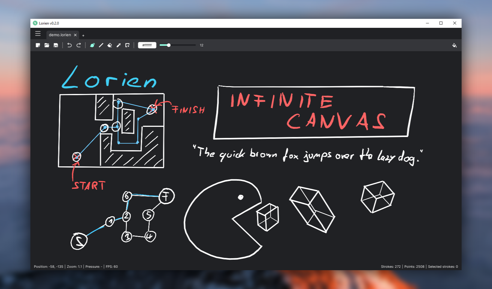

# Lorien

Lorien is an **infinite canvas drawing/note-taking app that is focused on performance, small savefiles and simplicity**. It's not based on bitmap images like Krita, Gimp or Photoshop; it rather saves brush strokes as a collection of points and renders them at runtime (kind of like SVG). It's primarily desinged to be used as a digital notebook and as brainstorming tool. While it can totally be used to make small sketches and diagrams, it is not meant to replace traditional art programs that operate on bitmap images. It is entirely written in the [Godot Game Engine](https://godotengine.org/). For an overview on how to use Lorien have a look [here](docs/manual.md). 

⚠ **This is very much a WIP and still a bit rough around the edges** ⚠. The savefile format *might* also change in the future. Contributions (be it bug reports, code, art or [translations](docs/i18n.md)) are very welcome.

## Features as of v0.2.0-dev:
- Infinite canvas
- Infinite undo/redo
- (Almost) Infinite zoom
- Extremely small savefiles ([File format specs](docs/file_format.md))
- Work on multiple documents simultaneously
- [Tools](docs/manual.md): Freehand brush, eraser, line tool, selection tool, move tool
- Deletion of selected strokes
- Basic Export: visible canvas as PNG
- Choose different colors for brush strokes and the canvas background via an easy to use color picker
- Designed to be used with a drawing tablet (Wacom, etc.). It also supports pressure sensitivity
- Localization: English, German, Italian 
- Runs on Windows, Linux & Mac

## More information
- [Contributing Guide](docs/contributing.md)
- [Localization](docs/i18n.md)
- [Changelog](docs/changelog.md)
- [Roadmap](docs/roadmap.md)

## Credits
- Icons used for the UI: [Remix Icon](https://remixicon.com/)
- Blurred background image of demo screenshot: https://unsplash.com/photos/nO0V_T0g2fM